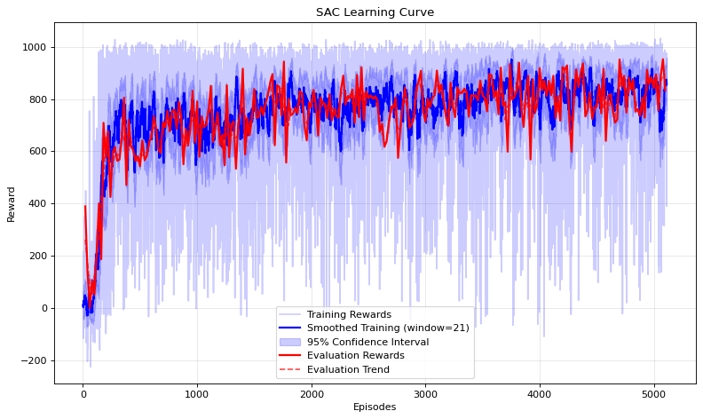

I'll update the README to include dedicated sections for learning curves and GIFs demonstration:

# Robot Navigation with Advanced Reinforcement Learning

This project implements both Soft Actor-Critic (SAC) and Proximal Policy Optimization (PPO) reinforcement learning algorithms for robot navigation in simulated environments. The implementation features a custom 2D differential drive robot environment and supports both continuous and discrete action spaces.

## Features

- **Multiple RL Algorithms**:
  - SAC with automatic entropy tuning
  - PPOCLIP with clipped surrogate objective
  - PPOKL with KL-divergence constraint
- **Custom Environment**: 2D navigation environment with obstacles
- **Vectorized Training**: Support for parallel training environments
- **Visualization**: Real-time rendering and progress tracking
- **Memory-Efficient**: Optimized for performance and memory usage
- **TensorBoard Integration**: Logging of training metrics

## Learning Curves

Single Critic SAC with entropy tuning


## Navigation Demonstrations

SAC Implementation at 100 episodes


SAC Implementation at 5000 episodes


## Installation

1. Clone this repository:
```bash
git clone https://github.com/adnanamir010/IsaacRL_Maze.git
git checkout alternate_timeline
cd IsaacRL_Maze/src/control/scripts
```

2. Install the required dependencies:
```bash
pip install -r requirements.txt
```

## Project Structure

- `agents.py`: Implementation of the SAC and PPO agents
- `models.py`: Neural network architectures for policy and value functions
- `memory.py`: Replay buffer for off-policy learning and rollout storage for on-policy algorithms
- `environment.py`: Custom robot navigation environment
- `train_sac.py`: Training script for SAC
- `train_ppo.py`: Training script for PPO variants
- `evaluate_sac.py`: Evaluation script for trained SAC models
- `evaluate_ppo.py`: Evaluation script for trained PPO models
- `rl_utils.py`: Utility functions for reinforcement learning

## Training

### Training SAC

To train a SAC agent on the custom navigation environment:
```bash
python train_sac.py --env-name VectorizedDD --num-envs 4 --batch-size 256 --hidden-size 128
```

#### Key Parameters for SAC
- `--env-name`: Environment name (default: "VectorizedDD")
- `--num-envs`: Number of parallel environments (default: 4)
- `--batch-size`: Batch size for training (default: 256)
- `--hidden-size`: Hidden layer size for neural networks (default: 128)
- `--num-steps`: Maximum number of steps (default: 1,000,000)
- `--render`: Enable visualization (only for single environment)

### Training PPO

To train a PPO agent on the custom navigation environment:
```bash
python train_ppo.py --env-name VectorizedDD --num-envs 8 --algorithm PPOCLIP
```

For the KL-constrained PPO variant:
```bash
python train_ppo.py --env-name VectorizedDD --num-envs 8 --algorithm PPOKL
```

#### Key Parameters for PPO
- `--algorithm`: Which algorithm to use: "PPOCLIP" or "PPOKL" (default: "PPOCLIP")
- `--env-name`: Environment name (default: "VectorizedDD")
- `--num-envs`: Number of parallel environments (default: 8)
- `--batch-size`: Batch size for updates (default: 2048)
- `--hidden-size`: Hidden layer size for neural networks (default: 128)
- `--clip-param`: Clipping parameter for PPOCLIP (default: 0.2)
- `--kl-target`: Target KL divergence for PPOKL (default: 0.01)
- `--update-interval`: Steps between PPO updates (default: 2048)
- `--render`: Enable visualization (only for single environment)

For a full list of parameters for any script, run:
```bash
python <script_name>.py --help
```

## Evaluation

### Evaluating SAC

To evaluate a trained SAC agent:
```bash
python evaluate_sac.py --checkpoint checkpoints/sac_checkpoint_VectorizedDD_final_1000 --hidden-size 128 --num-episodes 10
```

### Evaluating PPO

To evaluate a trained PPO agent:
```bash
python evaluate_ppo.py --algorithm PPOCLIP --checkpoint checkpoints/ppo_clip_checkpoint_VectorizedDD_PPOCLIP_update_100 --num-episodes 10
```

#### Key Parameters for Evaluation
- `--checkpoint`: Path to the checkpoint file
- `--algorithm`: For PPO only, which variant was used (default: "PPOCLIP")
- `--num-episodes`: Number of evaluation episodes
- `--hidden-size`: Hidden layer size (must match the trained model)
- `--render`: Enable visualization (default: True)
- `--delay`: Delay between frames for slowing down visualization (default: 0.01s)

## Environment

The custom environment (`VectorizedDDEnv`) simulates a 2D differential drive robot navigating through obstacles to reach a goal. The environment features:
- Lidar-based observations
- Randomly generated obstacles
- Customizable rewards for goal-reaching, collision avoidance, and efficient navigation
- Real-time visualization with pygame

## Algorithm Comparison

- **SAC**: Effective for continuous control tasks, sample-efficient with exploration driven by entropy maximization
- **PPOCLIP**: On-policy algorithm with clipped objective, simpler to tune than SAC but typically requires more samples
- **PPOKL**: Alternative PPO variant that uses KL-divergence to constrain policy updates, often more stable but slightly more complex

## TensorBoard Monitoring

You can monitor training progress using TensorBoard:
```bash
tensorboard --logdir runs/
```

## License

This project is licensed under the MIT License - see the LICENSE file for details.

## Acknowledgments

- SAC implementation based on the paper by Haarnoja et al. (2018)
- PPO implementation based on the paper by Schulman et al. (2017)
- Environment inspired by navigation challenges in robotics