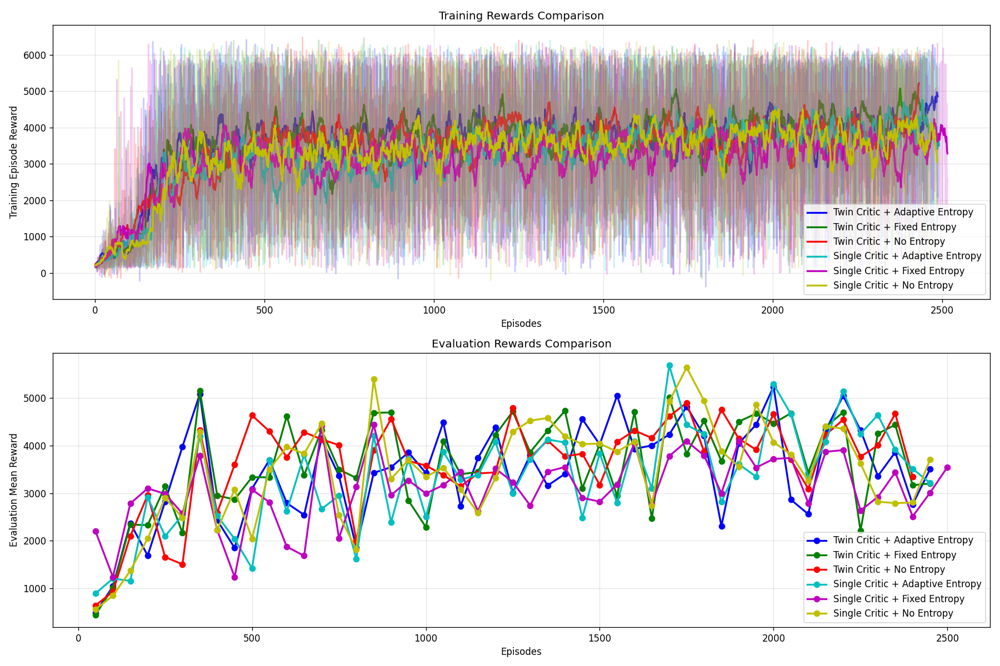
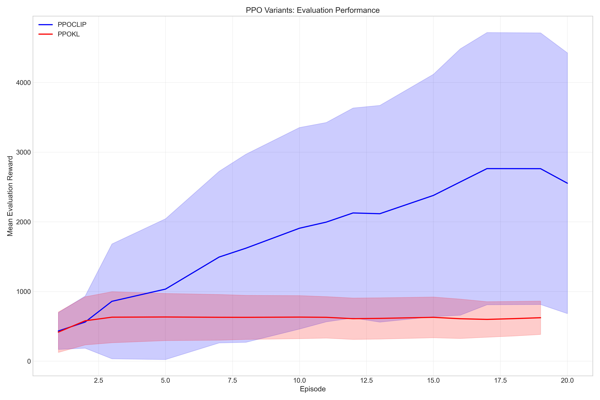
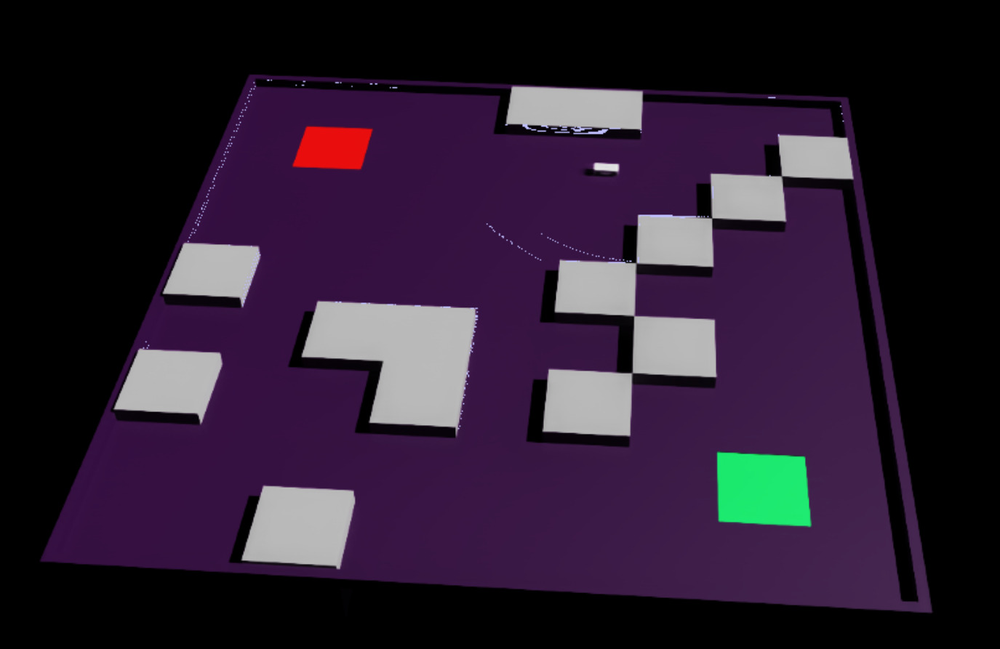

# Robot Navigation with Reinforcement Learning

This repository implements advanced reinforcement learning algorithms for robot navigation in simulated environments. It features a custom differential drive robot environment and supports multiple state-of-the-art RL algorithms, with comprehensive evaluation tools and visualization capabilities.

## Project Overview

This project provides a comprehensive framework for training and evaluating reinforcement learning agents for robot navigation tasks:

- **Multiple RL Algorithms**: Implementation of both on-policy (PPO) and off-policy (SAC) algorithms
- **Algorithm Variants**: Support for PPO-CLIP, PPO-KL, and SAC with various configurations
- **Custom Environment**: Vectorized differential drive robot environment with customizable obstacles
- **Action Space Flexibility**: Support for both discrete and continuous action spaces
- **Parallel Training**: Optimized for multi-environment training to improve sample efficiency
- **Evaluation Tools**: Thorough performance metrics and visualization capabilities
- **Comparative Analysis**: Tools for comparing different algorithms and configurations

## Algorithms

The implemented algorithms include:

- **Soft Actor-Critic (SAC)**: An off-policy algorithm featuring:
  - Automatic entropy tuning for balanced exploration
  - Twin critic architecture for reducing overestimation bias
  - Replay buffer for improved sample efficiency
  - Support for both continuous and discrete action spaces
  - Custom implementations for different critic architectures

- **Proximal Policy Optimization (PPO)**: On-policy algorithms with two variants:
  - **PPO-CLIP**: Uses clipped surrogate objective for stable policy updates
  - **PPO-KL**: Uses KL divergence constraint as an alternative approach

## Environment

The `VectorizedDDEnv` simulates a 2D differential drive robot with:
- 20 lidar rays for obstacle detection
- Relative goal position information
- Randomly generated obstacle fields
- Configurable obstacle shapes (square or circular)
- Flexible action space that supports both discrete (for easier learning) and continuous control (for more precise maneuvering)
- Reward function designed for efficient navigation and collision avoidance
- Support for vectorized training (multiple environments in parallel)

## Learning Curves

Below are the learning curves comparing the performance of the implemented algorithms:

SAC Learning Curve


PPO Learning Curve


## Training Visualization

The following GIFs demonstrate the agent's performance during different stages of training:

Untrained Agent Behavior


SAC Agent Behavior


PPOCLIP Agent Behavior


## Installation

1. Clone this repository:
```bash
git clone https://github.com/adnanamir010/IsaacRL_Maze
cd IsaacRL_Maze/src/control/scripts
```

2. Install the required dependencies:
```bash
pip install -r requirements.txt
```

## Usage

### Training SAC

```bash
python train_sac.py --env-name VectorizedDD --num-envs 4 --obstacle-shape square --entropy-mode adaptive --use-twin-critic
```

Key parameters:
- `--env-name`: Environment to use (`VectorizedDD` is the default)
- `--num-envs`: Number of parallel environments (default: 4)
- `--obstacle-shape`: Shape of obstacles (square/circular)
- `--entropy-mode`: Entropy regulation method (adaptive/fixed/none)
- `--use-twin-critic`: Whether to use twin critic architecture
- `--discrete`: Use discrete action space instead of continuous (default: False)
- `--action-dim`: Action dimension (automatically set based on discrete/continuous mode)

### Training PPO

```bash
python train_ppo.py --algorithm PPOCLIP --env-name VectorizedDD --num-envs 16 --obstacle-shape square
```

For PPO-KL:
```bash
python train_ppo.py --algorithm PPOKL --env-name VectorizedDD --num-envs 16 --kl-target 0.005
```

Key parameters:
- `--algorithm`: Which PPO variant to use (PPOCLIP/PPOKL)
- `--num-envs`: Number of parallel environments
- `--clip-param`: Clipping parameter for PPOCLIP
- `--kl-target`: Target KL divergence for PPOKL
- `--normalize-advantages`: Whether to normalize advantages

### Comparing Algorithms

```bash
python compare_agents.py --env-name VectorizedDD --obstacle-shape square --ppo-algorithm PPOCLIP --entropy-mode adaptive --use-twin-critic
```

This script runs both algorithms with configurable parameters and generates comparative performance metrics and visualizations.

### Evaluation

To evaluate a trained SAC agent:
```bash
python evaluate_sac.py --checkpoint checkpoints/sac_checkpoint_VectorizedDD_best.pt --num-episodes 10 --render
```

To evaluate a trained PPO agent:
```bash
python evaluate_ppo.py --algorithm PPOCLIP --checkpoint checkpoints/ppo_clip_checkpoint_VectorizedDD_best.pt --num-episodes 10 --render
```

### Analysis

The repository includes comprehensive analysis tools:
```bash
python analysis.py --results-dir results/latest_run --normalize-steps
```

This generates various plots and statistical analyses to compare algorithm performance.

## Project Structure

- `environment.py`: Custom differential drive robot environment
- `agents.py`: Implementation of SAC, PPOCLIP, and PPOKL algorithms
- `models.py`: Neural network architectures for all algorithms
- `memory.py`: Replay buffer and rollout storage implementations
- `rl_utils.py`: Utility functions for reinforcement learning
- `train_sac.py`: Script for training SAC agents
- `train_ppo.py`: Script for training PPO agents (both variants)
- `compare_agents.py`: Script for comparing multiple algorithms
- `evaluate_sac.py` & `evaluate_ppo.py`: Evaluation scripts
- `transfer_evaluate.py`: Tools for transferring models between environments
- `analysis.py`: Performance analysis tools
- `debug.py`: Debugging utilities
- `isaac_*.py` files: Isaac Sim integration components

## Performance Results

| Algorithm | Success Rate | Avg Reward | Training Time | Sample Efficiency |
|-----------|--------------|------------|---------------|-------------------|
| SAC       | 90%          | 4614.85    | ~2 hours      | 500K samples      |
| PPO-CLIP  | 70%          | 3842.25    | ~2.5 hours    | 5M samples        |
| PPO-KL    | 20%          | 620.42     | ~3 hours      | 5M samples        |

## Isaac Sim Integration

The project includes integration with NVIDIA's Isaac Sim for more realistic simulation:



To train with Isaac Sim:
```bash
python isaac_train_sac.py
```

### Model Transfer between Environments

A key feature of this project is the ability to transfer trained models between the Gym-based environment and Isaac Sim. This enables training agents efficiently in a simpler environment before transferring to the more realistic physics simulation:

```bash
python transfer_evaluate.py --checkpoint checkpoints/sac_checkpoint_VectorizedDD_best.pt --algorithm SAC --state-dim 22 --action-dim 1
```

Key parameters:
- `--checkpoint`: Path to the source model checkpoint (from Gym environment)
- `--algorithm`: Algorithm type (SAC, PPOCLIP, or PPOKL)
- `--state-dim`: State dimension (22 for the default environment)
- `--action-dim`: Action dimension (1 for differential drive control)
- `--output-dir`: Directory to save transferred models
- `--skip-eval`: Skip evaluation in Isaac Sim (useful if only model extraction is needed)

TBD - Model Transfer video


The transfer process extracts model parameters from the Gym-trained agent and creates a compatible version for Isaac Sim. For SAC agents, this is a direct transfer process, while PPO variants require manual integration due to architectural differences.

## Future Work

- Integration with ROS2 for hardware deployment
- Implementation of other RL algorithms (TD3, TRPO)
- Multi-agent navigation scenarios
- Transfer learning between simulation and real robots

## Citation

If you use this code in your research, please cite:

```
@misc{IsaacRLMaze,
  author = {Adnan Amir},
  title = {Robot Navigation with Reinforcement Learning},
  year = {2025},
  publisher = {GitHub},
  journal = {GitHub repository},
  howpublished = {\url{https://github.com/adnanamir010/IsaacRL_Maze}}
}
```

## License

This project is licensed under the MIT License - see the LICENSE file for details.

## Acknowledgments

- The SAC implementation is based on the paper by Haarnoja et al. (2018)
- The PPO implementation is based on the paper by Schulman et al. (2017)
- Environment design inspired by navigation challenges in mobile robotics